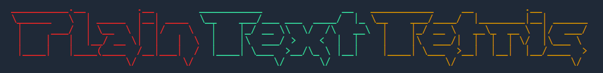

Play a simple plain text version of tetris, made only with ascii caracters.

You can try it live on: https://tetris.mtrentz.com.br

# Running locally

Install modules and run locally with npm
```
npm install
npm start
```

Or build and run the docker image:
```
docker build -t plain-text-tetris .
docker run -p 3000:80 plain-text-tetris
```
